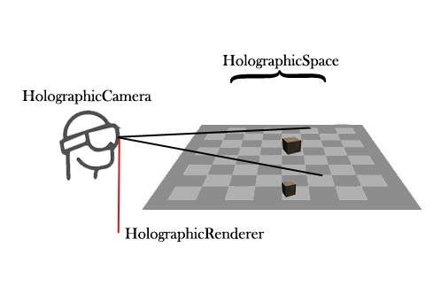
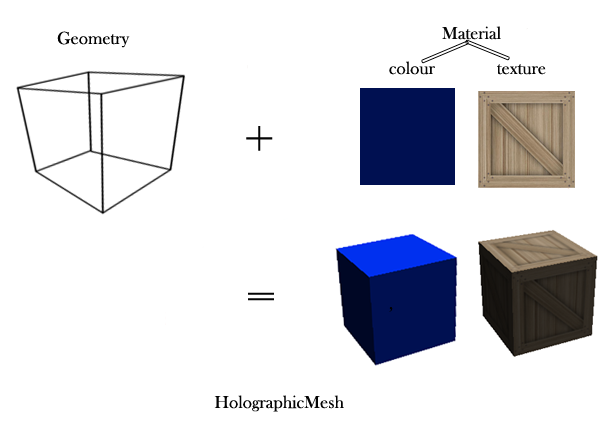

<a name="HOLTitle"></a>
# Building HoloLens Apps with buildwagon #

---

<a name="Overview"></a>
## Overview ##

This tutorial introduces developing HoloLens application in JavaScript based on [buildwagon](https://buildwagon.com/), a hololens development platform and libraries that make HoloLens development in JavaScript easy.

The main library that we will be using is [HoloBuild](https://buildwagon.com/documentation/), a library that helps you create dynamic holograms and provides a collection of components intended to abstract and accelerate the development of HoloLens applications.

The goal of this section is to give a brief introduction by setting up a basic HoloLens application that displays a box. A working example is provided at the bottom of the page.

To be able to display anything on a HoloLens we need three things:

*   a **HoloCamera**,
*   a **HoloSpace**,
*   and a **HoloRenderer**

A **HoloCamera** represents the HoloLens and where it is looking at.  
So let's define the hololens variable:
```
var hololens =  new HoloBuild.HoloCamera();
```	    

A **HoloSpace** represents a holographic scene, and its main purpose is to act as a container for all the holograms that make up the scene:

```
var holoscene = new HoloBuild.HoloSpace();
```	    

A **HoloRenderer** main purpose is to render the content of the holographic scene into the hololens.  

```
var holorenderer =  new HoloBuild.HoloRenderer();
	    
```
  



Now, to create a Hologram you need three things:

*   a **geometry**,
*   a **material**,
*   and a **HoloMesh**

The **geometry** is the shape that you want to draw, it contains all the polygons information that make up a hologram (Geometries will be discussed in more details in the following chapters).  
In addition to creating your own geometry, there is a set of prebuilt geometries that you can use. So let's get started by defining a **box geometry**. The box geometry takes as input the box's three dimensions (width, height, and depth):

```
var geometry = new HoloBuild.HoloBoxGeometry( 0.1, 0.1, 0.1 );
```	    

The default holobuild unit of measurments is meters, so this box has a 0.1 meter in width, 0.1 meter height, and 0.1 meter depth.  
A **material** defines how the surface of a geometry is. It describes the geometry appearance such as its color or its texture (i.e. skin). (Material will be discussed in more details in the following chapters).  
Let's define a standard material and give it a red color. By default the "Color" of the material is set to white, and you can change it to any color you want. The following is how to define a basic material with a red color:

```
var material = new HoloBuild.StandardMaterial( { color: "red" } );
```	    

A **HoloMesh** is an object that takes a geometry and applies a material to it. So it is the combination of a geometry and material into one 3D object or a hologram that can then be added to a scene.  



Let's define a holographic mesh that applies the created geometry to the material (HoloMesh will be discussed in more details in the following chapters):

```
var hologram = new HoloBuild.HoloMesh( geometry, material );
```	    

Lastly, you need to add the hologram to the holoscene:

```
holoscene.add( hologram );
```	    
  
If you run the above code, nothing will show, as you still need to call the renderer to render (or draw) the scene's holograms through the Hololens.  
To render the holoscene onto the HoloLens, you will need to call the **render** function of the HoloRenderer and give it the scene and the hololens as inputs:

```
holorenderer.render(holoscene, hololens);
```	    

Most of the time however, you need to animate your scene, so we will need to re-render the scene at specific interval. This could be done with **windows.requestAnimationFrame**, which takes a function that it will call again and again as efficiently as possible. All you have to do is place your animation code inside that function. Let’s try to add animation into our scene:

```
function animate(){
                windows.requestAnimationFrame(animate);
                HoloRenderer.render(holoscene, hololens);
              }
          animate();
```         

In this code, nothing much has changed, we have just placed our rendering call inside a function that will be called over and over by the requestAnimationFrame function. Next, we need to add our animation code inside the animate function. Let’s rotate our hologram around its X and Y axes:

```
function animate(){
	        windows.requestAnimationFrame(render);
	        hologram.rotation.x += 0.01;
	        hologram.rotation.y += 0.01;	        
	        HoloRenderer.render(holoscene, hololens);
        }
        animate();
```        

Every time the animate function is called, the hologram rotation property is increased by 0.01 for x and y axes. This makes the hologram looks its rotating around those axes.  
Congratulations! You have just created your first HoloLens application. Now, let's see how it looks like on the HoloLens emulator: 


You can try the emulator yourself at: [buildwagon online editor](https://www.binarieslid.com/hololensdevelopmentfullscreen.aspx) with some limitations or [create a free profile at buildawgon](https://secure.buildwagon.com/TenantRegistration/SelectEdition) to create your own projects. Try adding the code we created yourself and see how it works.

The HoloLens emulator allows you to test holographic apps on your browser without a physical HoloLens.  
**Emulator input:** Start by clicking on the human icon

*   Use the arrow keys on your keyboard **to walk forward, back, left, right**
*   Shift key + arrows keys **to look up, down, left, and right**
*   Ctrl key + up or down arrows keys **to move up, or down**
*   Use the mouse represents your hand, **To air tap gesture** Use the mouse left click.

A note about the HoloLens development Coordinate system:  
As we are working in 3d, the coordinate system is made of 3 axes: (X, Y, and Z). Using these axes we can refer to any position displayed by the HoloLens Device. This system considers the exact center of the space in front of the HoloLens as the origin with coordinate 0,0,0.  


  
So a point or a vertex with a 0.1,0,0 position will be displayed to the right of the origin, a -0.1,0,0 will be displayed to the left of the origin, a 0,0.1,0 will be displayed over the origin, and a 0,-0.1,0 under the origin. To move the point closer to the HoloLens you need to increase the Z value, and to move it further away you need to decrease the Z value.  
Adding a new hologram to the scene will position its center at the origin(0,0,0). In our example above, the box center is placed at the origin, which means since the box's height is 0.5Y then the top of the box will actually be at 0.25Y and the bottom of the box at -0.25Y. Why don't you change the values in the example code above and click on the "Run on HoloLens Emulator" button to see how it goes. To change a hologram position, you need to set its **position** as follows:

```
holomesh.position.set(0.1,0,0);
```	    

PS: You can place this line anywhere in the code after the holomesh definition but before animate function.  
**Position** property is one of the properties that you can use to manipulate where and how a hologram appears in the holographic space. The Position property defines the hologram position relative to the holographic space. You can set the X, Y, or Z coordinate of the hologram’s position as follows:

```
hologram.position.x = 0.1;
hologram.position.y = 0.5;
hologram.position.z = -0.5;
```

Alternatively, you can set the position in one shot as follows:

```
hologram.position.set(0.1, 0.5, -0.5);
```

A second property for manipulating holograms is **Rotation**. This property allows you to set the rotation of an object around any of its axes. Rotation is specified in radians, if you want to use degrees (from 0 to 360) instead, you should convert it as follows:

```
var degrees = 90;
var radians = degrees * (Math.PI / 180);
hologram.rotation.x = radians;
```

Similar to the position properties, you can rotate on any of the axis or set the rotation on all access in one shot using hologram.rotation.set(x,y,z);  
A third property for manipulating holograms is **Scale**. This property allows you to scale the object around its x, y, and z axes. You can scale a hologram along a specific axis. If you set the scale to values smaller than one, the hologram will shrink and if you set to a value larger than one, the hologram will expand.

```
hologram.scale.x = 0.1;
hologram.scale.set(0.1,1,1);
```

If you want to know more check the complete [hololens development tutorial:](https://buildwagon.com/guide.html)
